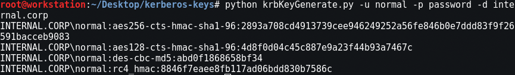
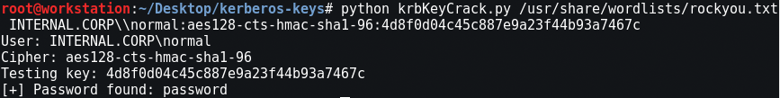
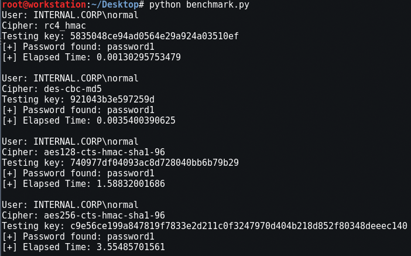

# Echidna

The following three scripts have been created to generate and identify Kerberos Keys.

* krbKeyGenerate - Generate Preshared Keys
* krbKeyCrack - Bruteforce Preshared Keys
* benchmark - Calculate relative key generation speed

## Prerequisites
Requires the following python libraries:
* pycrypto (>=2.6)
* pyasn1 (>=0.1.8)

Tested on
* Kali Linux 2017.1
* Ubuntu 16.04 LTS
* Windows 7

## Generate
Takes in a user, domain and password then utilizes [CoreSecurity's ](https://github.com/CoreSecurity/impacket/blob/master/impacket/krb5/crypto.py)
impacket krb5/crypto libraries to generate Kerberos keys.

```
python krbKeyGenerate.py -h
  usage: krbKeyGenerate.py [-h] -u USERNAME -p PASSWORD -d DOMAIN [-j]

  Kerberos Key Generator

  optional arguments:
    -h, --help            show this help message and exit
    -u USERNAME, --user USERNAME
            Case sensitive Username
    -p PASSWORD, --password PASSWORD
            Password for user
    -d DOMAIN, --domain DOMAIN
            Domain
    -j, --john Output
            jtr format
```

Example Command
```bash
python krbKeyGenerate.py -u user3 -d internal.corp -p password
```

Example



## Crack
Takes in the following structure, that of secretsdump output, then parses and attempts to crack just using a wordlist.

Example Keys
* AES-256
  * internal.corp\\user3:aes256-cts-hmac-sha1-96:64c314046a735376cfca78e8907dd086c896ba2b4b97ae76f3a2f35973f374cf
* AES-128
  * internal.corp\\user3:aes128-cts-hmac-sha1-96:c78e7cdbfe8bc1bdd51dc298a590ecac
* DES
  * internal.corp\\user3:des-cbc-md5:cbb0ef0ba22a7367
* RC4
  * internal.corp\\user3:rc4_hmac:8846f7eaee8fb117ad06bdd830b7586c

Help
```
python krbKeyCrack.py -h
  usage: krbKeyCrack.py [-h] [wordlist] [key]

  Kerberos POC Bruteforcer

  positional arguments:
    wordlist    Input wordlist
    key         Kerberos key with descriptor

  optional arguments:
    -h, --help  show this help message and exit
```

Example Command
```bash
python krbKeyCrack.py /usr/share/wordlists/rockyou.txt \
 internal.corp\\user3:des-cbc-md5:cbb0ef0ba22a7367
```

Example




## Benchmark
Takes in a user, domain and password then utilizes the previous two tools to create keys and benchmark the time needed to bruteforce the keys.

Example



## Author
* Mitchell Hennigan
